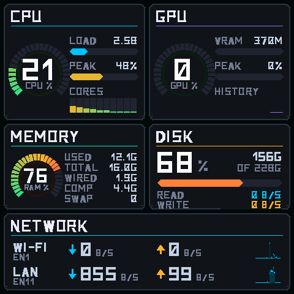
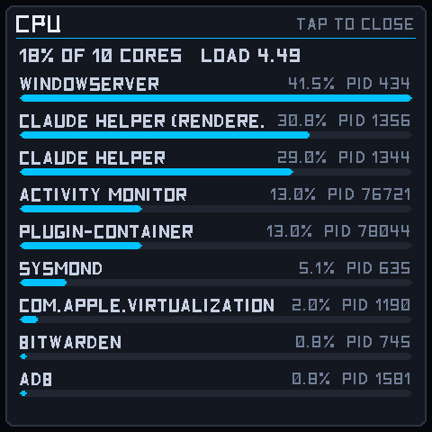
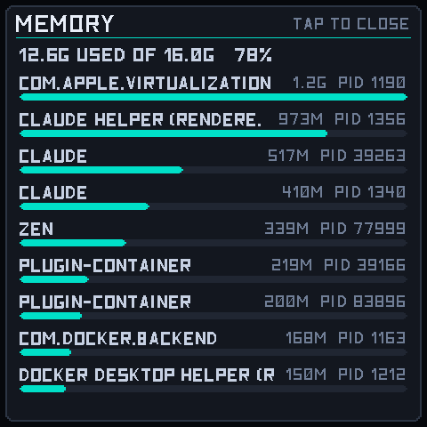
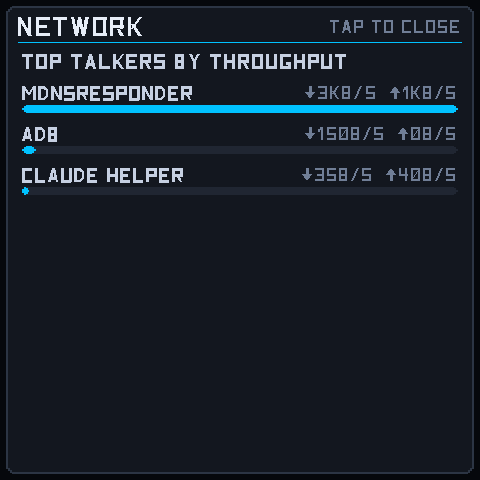
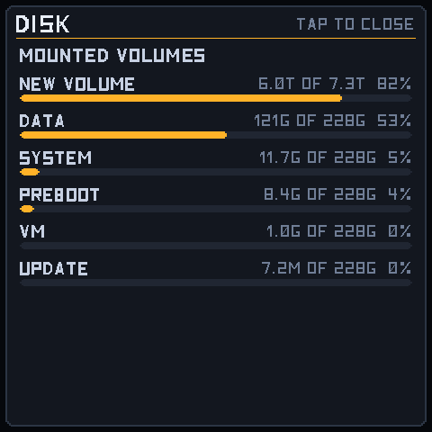

# MacStatP

A hardware system monitor for macOS. A small app on your Mac samples CPU,
GPU, memory, disk and network and sends them over USB to a
[Pimoroni Presto](https://shop.pimoroni.com/products/presto), which draws
them on its 480×480 touchscreen.



Tap a panel for a breakdown of what's actually using it.

---

## What you need

- A **Pimoroni Presto** running Pimoroni's MicroPython build.
  [v2.0.0](https://github.com/pimoroni/presto/releases/tag/v2.0.0) or later
  is recommended: it renders about 11% faster and adds screen rotation.
  Earlier builds work, minus the rotation setting.
- A **Mac** (Apple silicon or Intel), macOS 12 or newer
- A **USB-C cable** between the two
- [`mpremote`](https://docs.micropython.org/en/latest/reference/mpremote.html)
  to copy files to the board: `pip3 install --user mpremote`

Nothing needs `sudo`, and nothing needs an internet connection once the
repo is cloned.

## Install

**1. Put the dashboard on the board.**

```bash
git clone https://github.com/vwillcox/MacStatP.git
cd MacStatP
tools/deploy.sh --run
```

The screen should show a standby card saying it's waiting for your Mac.

**2. Install the Mac app.**

```bash
tools/install_app.sh
```

This builds `MacStatP.app`, puts it in `/Applications`, and sets it to
start at login and restart itself if it ever stops. It runs in the
background — no Dock icon. Within a few seconds the board should come to
life.

If it stops with a permissions error, `~/Library/LaunchAgents` is owned by
root on your machine. The script prints the one `sudo chown` command that
fixes it; run that and try again.

**3. Open the settings** at **http://127.0.0.1:8765/** — or use the menu
bar item, below.

## The menu bar item

`tools/install_app.sh` also installs **MacStatP Control**, which puts a
small gauge icon in the menu bar. The agent itself runs in the background
with no interface, so this is where you reach it:

| Menu | |
|---|---|
| **Open Settings…** | The configuration page |
| **Restart Agent** | Restarts the background agent |
| **Stop Agent** / **Start Agent** | Whichever applies |
| **Show Log** | Opens `agent.log` |
| **Show in Dock** | Adds a Dock icon as well as the menu bar item |
| **Open at Login** | Brings the menu bar item back after a restart |
| **Quit** | Closes the menu bar item; the agent keeps running |

The top of the menu shows what's happening — whether the agent is
running, whether the board is connected, and how many frames have been
sent.

It starts in the menu bar. **Show in Dock** adds a Dock icon too, if you'd
rather have it there; it's the same process either way. Turn **Open at
Login** on if you want the icon back automatically after a reboot —
the display agent itself already starts on its own.

Launch it any time from `/Applications/MacStatP Control.app`.

## Using it

| Gesture | What it does |
|---|---|
| **Tap a panel** | Opens a full-screen breakdown of it |
| **Tap again** | Back to the dashboard |
| **Hold anywhere** | Cycles the backlight brightness |
| **Swipe down from the top** | Switches to the desk pet, if installed |

## Settings

The settings page is organised into tabs. Changes take effect
immediately — nothing needs restarting.

| Tab | What's there |
|---|---|
| **Status** | Whether the board is connected, frames sent, sample time |
| **Panels** | Which panels appear, and in what order |
| **Connection** | Serial port, and how many updates a second to send |
| **Display** | Brightness, orientation, bytes vs bits, detail refresh |
| **Measure** | Which disk volume and which network interfaces to watch |
| **App** | The desk pet switch, start at login, page port |

### Orientation

If the board is mounted upside down — which the USB-C socket often
encourages — set **Orientation** to "Upside down" on the Display tab. The
touchscreen follows, so taps still land where you expect. This needs
firmware v2.0.0 or later; on older builds the page says so and leaves the
option disabled.

Changing it restarts the board, since the panel's orientation is fixed
when it is created.

### Choosing panels

On the **Panels** tab you can switch any panel off, and drag the rows (or
use the arrows) to change their order — that's the order they appear on
the screen. Whatever's left grows to fill the display: two panels to a
row, with a full-width row for the network.

The page is only reachable from your own Mac. It has no password, and it
shows what your machine is running, so it deliberately isn't available to
anything else on the network.

## What's on screen

| Panel | Shows |
|---|---|
| **CPU** | Overall %, 1-minute load, busiest core, per-core bars |
| **GPU** | Utilisation, VRAM in use, recent peak, history plot |
| **MEMORY** | Pressure %, used/total, wired, compressed, swap |
| **DISK** | Volume capacity, read and write throughput |
| **NETWORK** | Wi-Fi and wired links, each with down/up and a sparkline |

### Tap for detail

| Tap | Full-screen view |
|---|---|
| CPU | Top processes by CPU share, with PIDs |
| GPU | Device / renderer / tiler utilisation, VRAM in use vs allocated |
| MEMORY | Largest processes by resident memory |
| DISK | Mounted volumes, biggest consumer first |
| NETWORK | Top talkers per process, with down and up rates |

| | |
|---|---|
|  |  |
|  |  |

Everything is read without `sudo`.

## The desk pet (optional)

The board can also run
[BuddyPresto](https://github.com/vwillcox/BuddyPresto), a desk pet that
talks to the Claude desktop app over Bluetooth and lets permission prompts
be answered from the touchscreen. It shares this project's typeface and
palette, so the two look like one device.

It's entirely optional and completely separate — `tools/deploy.sh` never
touches it:

```bash
git clone https://github.com/vwillcox/BuddyPresto.git   # next to this one
tools/install_buddy.sh              # install it
tools/install_buddy.sh --uninstall  # remove it
```

Once installed, the **Desk pet** switch on the App tab decides whether it
runs. Switching it off restarts the board, which takes a few seconds — the
pet's Bluetooth tasks can't be stopped any other way, and leaving the radio
on while the setting said "off" would be misleading.

## If something goes wrong

**The screen says "waiting for Mac".** The app isn't running. Check
`~/Library/Logs/StatusDisplay/agent.err`, or run
`python3 host/agent.py` in a terminal to see what it says.

**Nothing on the screen at all.** Unplug the USB cable, wait a few
seconds, plug it back in. If it's still dead, see
[recovering a wedged board](TECHINFO.md#recovering-a-wedged-board).

**A setting didn't seem to apply.** The board reports back what it
actually applied, and the app logs it. Look for `board applied` in
`~/Library/Logs/StatusDisplay/agent.log`.

## Uninstall

```bash
tools/install_app.sh --uninstall      # the agent, the menu bar item, login items
tools/install_buddy.sh --uninstall    # the desk pet, if you installed it
```

Your settings stay in `~/Library/Application Support/MacStatP/` in case
you reinstall; delete that folder to remove them too.

---

## Technical details

How it's put together, why the board does the drawing, the custom
typeface, the tests, and how to work on the layout:

**[TECHINFO.md](TECHINFO.md)**

## Licence

MIT — see [LICENSE](LICENSE).
