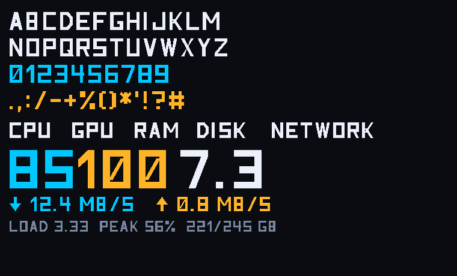

# MacStatP — technical notes

How the thing is put together, and why it's put together that way. For
installing and using it, see [README.md](README.md).

## How it fits together

```
   Mac                              USB serial                 Presto
   ┌───────────────────────┐                        ┌──────────────────────┐
   │ macstats.py  sample   │  ~540 bytes of JSON    │ link.py    parse     │
   │ agent.py     send  ───┼───────────────────────►│ dashboard.py  draw   │
   │ webui.py     settings │◄───────────────────────┼── stdout tags        │
   └───────────────────────┘   #V: #C: #I: #B:      └──────────────────────┘
```

The Mac samples once per frame and sends one compact JSON object per line.
The board parses it and draws the panel itself. Settings ride along in the
same frame, so there's no second channel to keep in sync.

The board talks back over its stdout, which the agent is already draining:

| Tag | Meaning |
|---|---|
| `#V:` | A panel was opened or closed, so gather (or stop gathering) process detail |
| `#C:` | Settings the board actually applied |
| `#I:` | What this board has and can do: whether the desk pet is installed, and whether the firmware can rotate |
| `#B:` | The desk pet levelled up |

`#C:` exists because a setting that silently fails to apply is very hard to
diagnose. Working it out from screenshots once cost an afternoon: a stale
capture looked exactly like a setting being ignored.

## Why the board draws, not the Mac

Streaming rendered pixels from the Mac was built and measured, and lost:

| | measured |
|---|---|
| USB serial throughput | 237 KB/s |
| Panel `update()` (DMA to screen) | 23.5 ms → ~42 fps ceiling |
| On-device render, 200 MHz stock | 166 ms → 6.0 fps |
| On-device render, 264 MHz overclock | 138 ms → 7.2 fps |
| Same, on firmware v2.0.0 (MicroPython 1.29) | 124 ms → **8.1 fps** |
| Full 480×480 RGB565 frame | 460,800 B → 1.9 s |

Frames only get small if the artwork is flat-shaded: a delta-encoded frame
compresses to ~5 KB, but the same frame rendered with antialiasing is ~5×
larger, and zlib is a dead end because the board inflates at only 1.7 MB/s
(270 ms per frame). Pushing pixels also stalled the USB link in practice.

Sending ~540 bytes of JSON and letting the board draw is simpler, more
robust, and leaves the board able to run standalone.

WiFi was considered and rejected for the same reason: at ~540 bytes a frame
the transport is nowhere near the bottleneck — the panel's own 24 ms update
and the ~138 ms render are. WiFi would only matter if pixels were streamed.

The RP2350 is overclocked from its stock 200 MHz to 264 MHz in
`device/main.py`. Rendering is entirely CPU-bound, so that's a
proportional gain. If Bluetooth misbehaves with the desk pet installed,
put `CLOCK_HZ` back to `200_000_000` and compare before blaming the
bridge — the radio is driven over PIO SPI.

## Firmware

Built against Pimoroni's Presto firmware. v2.0.0 moved from MicroPython
1.26 to 1.29, which is worth having: the same render dropped from 138 ms
to 124 ms, about 11% for free. It also fixed a PIO stall in
`start_frame_xfer` that could leave the panel blank, and made the FT6236
touch controller survive transient I2C failures instead of raising —
both of which this project was carrying its own defences against.

Two things to know if you are on an older build:

- **Rotation** (`rotate=ROTATE_180`) arrived in v2.0.0. `device/main.py`
  imports it defensively and falls back to no rotation, so the code runs
  unchanged on v1.0.0; the settings page disables the option and says
  why.
- `tools/recover.sh` fetches v2.0.0. Change `FW_VERSION` in it to flash
  something else.

`@micropython.native` is worth a note: `hasattr(micropython, "native")`
is False on 1.29, which looks alarming, but the decorator is handled by
the compiler rather than resolved at runtime and still works. Test it by
compiling something, not by asking the module.

## Collecting the metrics

Everything is readable by a normal user, no `sudo` anywhere:

| Metric | Source |
|---|---|
| CPU | `host_processor_info()` via ctypes |
| GPU | `IOAccelerator` performance statistics from `ioreg` |
| Memory | `vm_stat` plus `sysctl hw.memsize` |
| Disk | `statvfs` for capacity, `IOBlockStorageDriver` for throughput |
| Network | `netstat -ibn` byte counters |
| Per-process | `ps`, and `nettop -n -P` for per-process network |

The `-n` on `netstat` and `nettop` is essential, not cosmetic. Without it
they reverse-resolve addresses, and with the network down those lookups
block until DNS gives up: `netstat -ib` took 5 s instead of 10 ms, which
emptied the interface list and dragged a 29 ms sample out to 3 s. Working
DNS had been hiding that for weeks.

Process listings are only gathered while a detail panel is actually open —
they're about ten times the size of a summary frame and cost ~25 ms — which
is what the `#V:` tag is for.

## Layout engine

Nothing assumes a fixed grid. `pack()` in `device/dashboard.py` takes the
enabled panels, in the order chosen in the settings, and lays them out:
pairs share a row, the network takes a full-width row, and row heights are
shared out by weight with the last row stretched to the bottom margin so
rounding can't leave a gap.

Each panel then works out its contents from the box it's handed, so the
same code draws a half-width card and a full-screen one. Gauges and text
scale, value columns are measured against the labels beside them, and
where there's more room than the contents need the surplus goes into the
gaps with the remainder centred, rather than stretching everything.

All 31 on/off combinations and all 325 orderings are checked by the tests.

## The font

The panel uses a purpose-built display face, "Presto Techno" — bold and
squarish to match the hardware monitors it's modelled on. Glyphs are
defined as filled polygons on a 20×28 grid in `tools/glyphs.py`, so they
scale to any size. `tools/build_font.py` packs them into a ~1.1 KB table;
78% of strokes are axis-aligned rectangles, which PicoGraphics fills about
four times faster than the equivalent polygon.

The renderer hints the outlines, which matters on a panel with no
antialiasing: every glyph starts on a whole pixel so repeated letters are
identical, and any stroke drawn at the design stem width is forced to the
same pixel width. Without that, stems alternated between 2 px and 3 px
depending on where they landed, which is what made small text look soft.



```bash
python3 tools/fontpreview.py   # specimen sheet
python3 tools/build_font.py    # rebuild device/font_data.py
```

## Working on the layout

Four ways to see a change without guessing:

```bash
python3 tools/preview.py                      # software render -> build/preview.png
python3 tools/preview_panels.py               # every panel combination
python3 tools/preview_detail.py               # every drill-down screen
python3 host/agent.py --preview out.png       # same layout, antialiased 3x
```

And on the hardware itself:

```bash
python3 tools/capture.py -o shot.png          # real framebuffer off the board
python3 tools/capture.py --live -o shot.png   # drive the running board, then screenshot
```

`device/dashboard.py` runs unmodified on both the board and the Mac, so
the preview is the same code that ships. `tools/capture.py` deletes the
previous screenshot before asking for a new one — reading a stale file
back looks exactly like a successful capture, and once did.

## Tests

```bash
python3 host/test_agent.py     # link handling: unplug, replug, bad samples
python3 host/test_webui.py     # settings page, over real HTTP
python3 host/test_pushcode.py  # the raw REPL transfer, against a fake board
```

Both drive the real code paths — a fake serial port for the link, an
actual server for the page.

Two of the assertions are there because the bug they catch actually
happened. The settings page must never run `launchctl` against its own
label: the page is served *by* the agent, so doing that unloaded the
process mid-request and changing the brightness stopped the display. And
`Display.set_backlight` must route to the Presto rather than being
forwarded to PicoGraphics, where it silently does nothing.

## Project layout

```
host/     agent.py         samples the Mac, sends one JSON line per frame
          macstats.py      all the metric collection
          config.py        settings, stored outside the checkout
          webui.py         the settings page, loopback only
          pilshim.py       PicoGraphics-shaped surface backed by Pillow
          test_agent.py    tests for the link
          test_webui.py    tests for the settings page
          installer.py     borrows the port from the stream loop
          pushcode.py      raw REPL file transfer, no mpremote needed
          test_pushcode.py tests for the transfer
device/   main.py          render loop on the board, and the mode switch
          dashboard.py     panel layout and the packing engine
          widgets.py       cards, radial gauges, meters, sparklines
          font.py          renderer for the custom display face
          font_data.py     generated glyph table (do not edit)
          link.py          newline-delimited JSON over USB serial
          storage.py       SD card: settings, history, error log
          buddy_mode.py    glue for the desk pet (installed separately)
packaging/launch.py        entry point inside the agent .app bundle
          Info.plist       agent bundle metadata
          MenuBar.swift    the menu bar item, compiled at build time
          Control-Info.plist  its bundle metadata
          control.py       scripted fallback where Swift is unavailable
dist/     MacStatP.app     prebuilt, committed so no compiler is needed
          MacStatP Control.app
          BUILD.txt        which commit they came from
tools/    deploy.sh        copy the dashboard to the board
          install_app.sh   build and install MacStatP.app
          install_buddy.sh install or remove the optional desk pet
          build_app.sh     assemble the .app bundles
          make_dist.sh     rebuild and refresh dist/
          make_dmg.sh      build a disk image of both apps
          make_icon.py     render the app icon from the panel's own motif
          recover.sh       reflash a board stuck in BOOTSEL
          capture.py       screenshot the board's real framebuffer over USB
          preview*.py      software renders of the layout
          glyphs.py        font design source
          build_font.py    pack glyphs.py into device/font_data.py
          raster.py        tiny scanline rasteriser behind the previews
```

Settings live in `~/Library/Application Support/MacStatP/config.json`,
deliberately outside the checkout. The launch agent once pointed at a copy
of the repo that had been moved to another disk and simply sat there
failing to start; nothing needed at runtime should live at an address that
can move.

## Installing to the board from the page

The **Presto** tab copies the dashboard onto the board without `mpremote`
or any other tool, by speaking MicroPython's raw REPL over the serial
port (`host/pushcode.py`):

```
\r\x03\x03   interrupt whatever is running
\x01         enter raw REPL   -> "raw REPL; CTRL-B to exit\r\n>"
\x04         soft reset       -> a clean VM, and main.py does not re-run
<code>\x04   run it           -> [OK] stdout \x04 stderr \x04 ">"
\x02         back to the friendly REPL
```

Globals persist between submissions in raw mode, so a file is opened
once and written in chunks of base64.

Three things that had to be right, each of which wedged the board until
it was:

- **The soft reset is not optional.** Ctrl-C stops the running program
  but leaves asyncio tasks scheduled, and the desk pet's Bluetooth tasks
  kept going. Opening a file for writing then blocked and took the board
  with it. Resetting from raw mode clears everything.
- **Flow control is not optional either.** The board's USB receive buffer
  is a couple of hundred bytes, so a single large command overruns it and
  the board simply stops answering. Raw-paste mode (`\x05A\x01`) has the
  board advertise a window and ask for more as it consumes.
- **Anything read past a terminator belongs to the next reply.** Dropping
  it stalled every command after the first, because a whole reply often
  arrives in one chunk.

Chunk size and the serial read timeout dominate the transfer: 512-byte
chunks with a 0.3 s timeout gave 4.3 KB/s, while 4 KB chunks with a
0.05 s timeout give 18.7 KB/s — the whole dashboard in a few seconds.

The agent holds the port continuously, so an install borrows it:
`host/installer.py` raises a flag, the stream loop closes its port and
confirms, the files go across, and the loop reconnects afterwards the way
it would from any other disconnection. The device's own `.py` files are
copied into the app bundle at build time, so this works from
`/Applications` with no checkout present.

## The menu bar item

`MacStatP Control` is a separate bundle from the agent, and deliberately
so: the agent is a long-running background process, and giving it a user
interface would mean running an NSApplication event loop alongside the
frame loop for no good reason. Two processes, each doing one thing.

It's written in Swift because a menu bar item needs a real
`NSStatusItem`, and compiling it means nothing has to be installed
alongside — the system Python has no PyObjC. `tools/build_app.sh`
compiles it with the CommandLineTools SDK.

Where `swiftc` isn't available the build falls back to
`packaging/control.py`, which uses `osascript` for a dialog and needs a
Dock icon rather than a menu bar item. It can do the same things, less
elegantly.

### Disk images

`tools/make_dmg.sh` stages both apps with an Applications symlink and a
plain-text note, and builds a compressed image — about 770 KB. Ad-hoc
signatures survive it, verified by mounting the result and running
`codesign --verify` on what comes out.

What does not survive is Gatekeeper's patience. A downloaded image is
quarantined, and without a Developer ID signature and notarisation macOS
refuses a plain double-click. Right-click and Open clears it for that
app, which is why the note inside the image says so rather than leaving
someone to work it out. Notarising properly needs a paid Apple developer
account.

### Committed binaries

`dist/` holds both bundles already built. Committing build output is
normally a bad habit — it goes stale, and the binary stops matching the
source that claims to produce it. It earns its place here for one
reason: without a Swift compiler there is no menu bar item at all, and
requiring Xcode's command line tools to get a menu bar icon is a poor
trade.

Two mitigations. `dist/BUILD.txt` records the commit they were built
from, so drift is visible rather than silent, and `tools/make_dist.sh`
refreshes them in one step. `tools/install_app.sh` still builds from
source whenever `swiftc` is present, and only falls back to `dist/`
when it is not.

The bundles are ad-hoc signed. That survives a `git` round trip, since
the signature lives in the file contents rather than in extended
attributes — but a ZIP download picks up `com.apple.quarantine`, which
has to be cleared before macOS will open them.

`LSUIElement` is true in its Info.plist, so it starts in the menu bar.
"Show in Dock" calls `setActivationPolicy(.regular)` at runtime, which
adds the Dock icon without restarting. The preference lives in
`UserDefaults` rather than the shared config file: it belongs to the
control app, and putting it in the config would mean the settings page's
schema had to carry a key it has no business knowing about.

Restarting the agent uses `launchctl kickstart -k`, which is atomic.
Doing it as bootout-then-bootstrap races with launchd letting go of the
label; that path is only the fallback.

## Recovering a wedged board

Binary protocols on USB CDC need `micropython.kbd_intr(-1)`, which
disables Ctrl-C. If that's left on, `mpremote` can no longer interrupt the
board and a reflash is the only way back — which happened once during
development. The shipped `device/main.py` never disables Ctrl-C, so the
board always stays reachable.

If a board does get stuck:

1. Unplug USB, hold **BOOT** on the back, plug USB back in, release.
2. `tools/recover.sh` — it waits for the `RP2350` volume, downloads the
   Pimoroni firmware if it isn't already in `firmware/`, and flashes it.
3. `tools/deploy.sh --run`.

Note that RP2350 boards mount as `RP2350`, not the `RPI-RP2` you may be
expecting from an RP2040.

## Notes

- The SD card holds `/sd/status/` — settings, sparkline history that
  survives reboots, and a small error log. It's worth reading when
  something on the board misbehaves.
- `backup-presto-flash/` (local only, gitignored) holds whatever was on
  the board before this project. If yours contains WiFi credentials or API
  keys, keep it out of version control.
